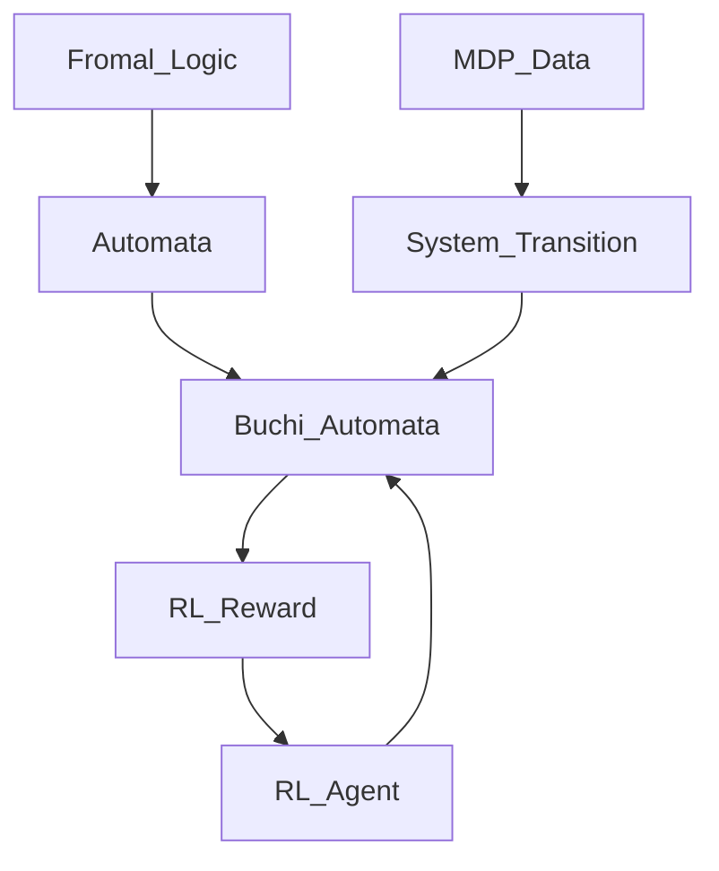
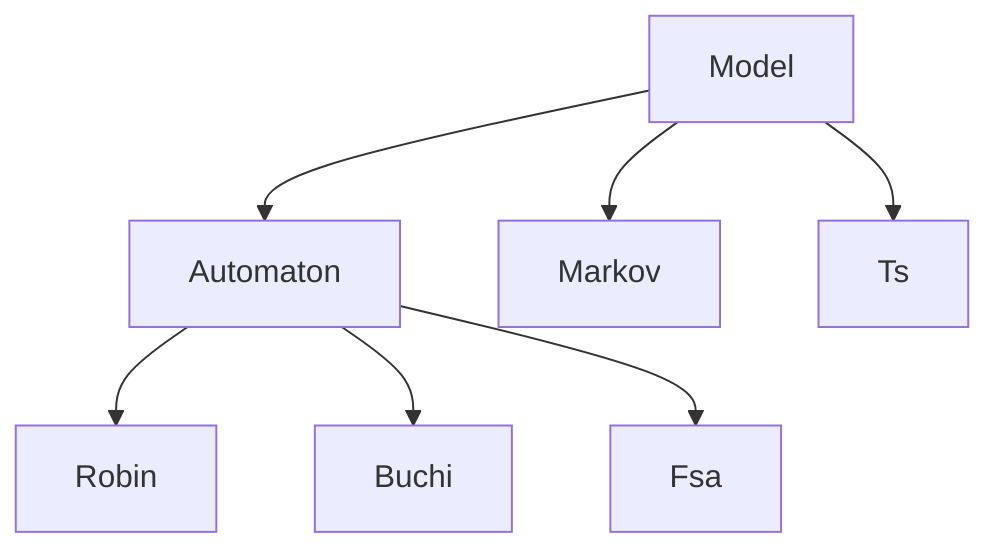
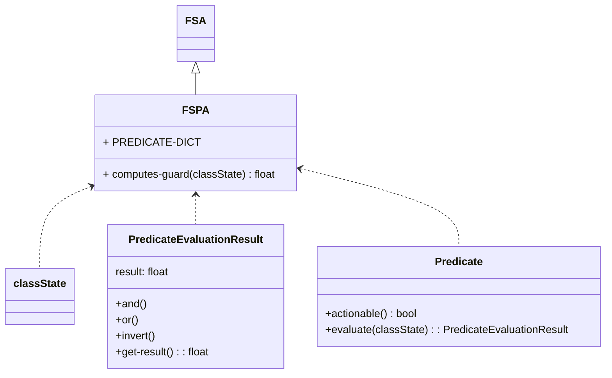
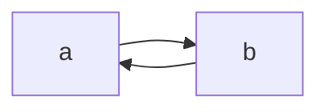
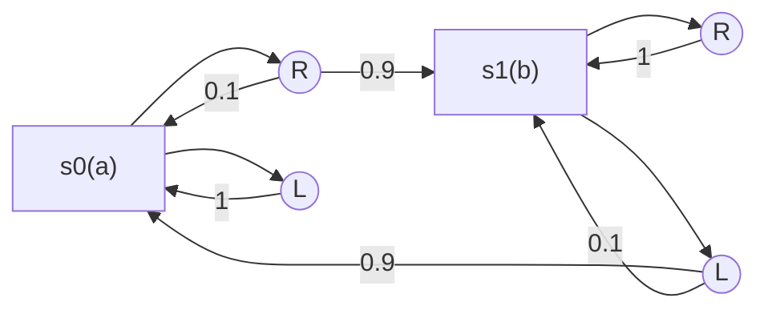
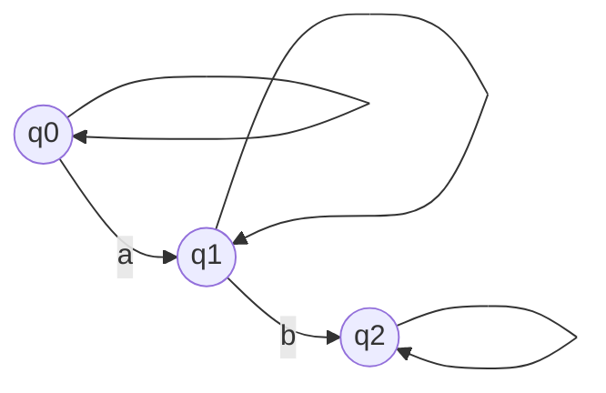
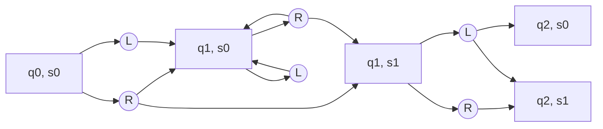
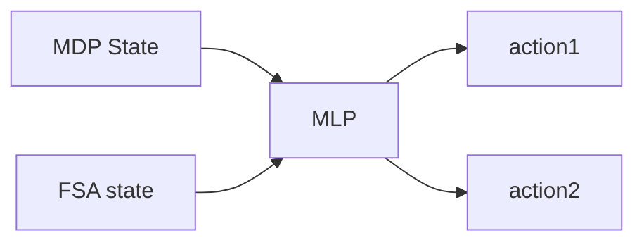
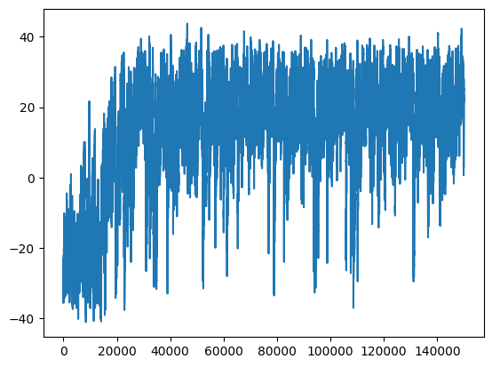

# Reproduce Formal RL

## A formal methods approach to interpret-able reinforcement learning for robotic planning

---

## Pipeline



---

## Software

1. **Formal Logic**

Lexical Definition

Parser

1. **Formal Logic → Automata**

a. LOMAP

[https://github.com/wasserfeder/lomap](https://github.com/wasserfeder/lomap)

LOMAP uses *[Spot](https://spot.lre.epita.fr/install.html) and [ltl2dstar](https://www.ltl2dstar.de/)* as its bases.

Both Spot and ltl2dstar support [Spin](https://spinroot.com/spin/whatispin.html).

**b. Classes of LOMAP**



**c. Graph Representation : [networkx](https://networkx.org/)**

- Node
- Edge : {prev_node, next_node, attribute:’could be any hashable objects’}

**d.Spin format**

Grammer

- ltl ::= opd | (ltl) | ltl binop ltl | unop ltl

opd

- true, false

op

- finally <> **F**
- globally [] **G**
- next **X**
- until **U**
- not **!**
- and **&&**
- or **||**
- implication **→**
- equivalence **↔**

e.Spot

f. ltl2dstar

1. **Buchi Automata**
2. **RL**

---

## Implementation

### FSPA

Finite state predict automata is a fsa with computable edges.

{states, transitions, guards, initial states, final states}



### Reinforcement learning

1. Algorithm

**PPO will the default algorithm**

```python
# environment initilization
# actor and critic model initlization
# while loop
	# RUN simulation until finished

	# compute V(s), remenber R
	# update v
	# Advantage = R + V(S_t-1) - V(S)
	# gradient = log(pi(a|theta))Advantage
```

**Sometimes, Deep Q learning can also be deployed**

Experience Replay - reduce vairence

Update Tearget network after C-steps - reduce varince

Double DQN(Q network for chossing actions, target network for evaluatiing) — avoide false positive

$$
Q_{t+1}(s_t, a_t)=Q_t(s_t, a_t) + \alpha(r_t + \gamma max_a Q_t(s_{t+1}, a) - Q_t(s_t, a_t))
$$

1. MDP

MDP {S, A, Sigma, R, T}

R and T are unknonwn initially.

FSPA  —> R

T is learned through experience

product automaton: MDP and FSPA

**How to get the product automaton**

**Template midlevel fspa**

deterministic automaton

Actor-critic
method–proximal policy gradient (37) as our RL algorithm.

curriculum training

1. Reward

1. FSPA guied MDP
2. Implementation on GYM

[Gymnasium ](https://www.notion.so/Gymnasium-8de5233e7be545e8ac908431f32eaf6d?pvs=21)

---

## Example Analysis

### Environment



### MDP



### LTL and FSA



### Product MDP



### How to compute the reward

$$
R(s_t, a, s_{t+1})=\min_{i \in [0, 1, ..., out edge]}(\rho(out(q_{t+1})^i, s_{t+1}))
$$

$$
R(s_{t},a_{t}) = E_{s_{t+1}~P}[R(s_{t}, a_{t}, s_{t+1})]
$$

```
Algorithm
----------------------------------------------------------------------

**********A gym wrapper for computing ltl reward

Input: PFSA, MDP State:********** S**********, Next MPD State:********** NS,  **********FSA Q:********** q 

**********Next FSA State:********** nq = fsa.nextQ(s, q)
**********Get all Out Edges:********** edges = fsa.outedge(nq)
**********Compute the smallest predicate:********** p = samllest(edges, NS)

**********Reward = p

return********** Reward
```

### PPO network architecture

$$
J(\theta) = E[R(\tau)]
$$

$$
g = \sum_{t=0}^{H} \nabla \log \pi(a|s^{(t)})Adv
$$



---

## Development

1. Grid World, Fully Observable, Dense Reward: Distance to target ,Discrite Control
2. Grid World, Partially Observable, Sparse Reward: 0, 1, finished or not, Discrete Control
3. Continues World, PPO

### Simulation Envs

1. MiniGrid

[MiniGrid Documentation](https://minigrid.farama.org/)

1. pybullt manipulation
2. meta-world (mojo-co based environment)
This environment is for ******************************************Multi-task RL and Meta-Learning******************************************

[Meta-world](https://www.notion.so/Meta-world-6336bf7b6579461283e5a96263f4ca76?pvs=21)

[GitHub - Farama-Foundation/Metaworld: Collections of robotics environments geared towards benchmarking multi-task and meta reinforcement learning](https://github.com/Farama-Foundation/Metaworld#accessing-single-goal-environments)

---

## Issues

1. The reward will escalate near 0;
2. State space expanded by the number of fspa states. A simple fspa can have 10 or more states. The total fspa guided MDP’s state number is multiplied by the factor of 10 or more.
3. TLTL’s dense rewards are hard to converge to the “real goal”. The agent gets more reward staying near the Predicate boundary, where has the highest robustness, than going to the next fspa state. Once the fspa runs into the next state, the robustness will drop dramatically as the target state changes.
4. 

---

## 6. Testing

We test our algorithm on a simple 8*8 minigrid world. The reward is composed of four parts:

<aside>
💡 ********Note: we do not use TLTL robustness here as rewards here.********

</aside>

```python
reward = 0
next_p = self.fspa.get_next_state_from_mdp_state(self.current_p)
"Reward I: Encourage FSPA state transition"
if next_p != self.current_p:
	reward = 5

terminated = (next_p in self.fspa.final)
"Reward II: Complete the whole mission"
if terminated:
	# print(terminated,"next p", next_p, self.env.agent_pos, reward)
	reward = 50
	#reward = reward - 0.9 * (self.step_count/self.max_steps)
"Reward III: Punish transition to trap states"
if next_p in self.fspa.trap:
	truncated = True

if truncated:
	reward = -50
"Reward IV: Energy for steps "
reward = reward - 10*(self.step_count/self.max_steps)

self.current_p = next_p
```

```python
env = TltlWrapper(env, tltl="F p1 & F p2 & F p3 & (! p1 U p2) & (! p2 U p3)",
                  predicates={'p1': PositionPredicate(True, [3, 3]), 'p2': PositionPredicate(True, [5, 5]),
                              'p3': PositionPredicate(True, [2, 2])})
```

- **reset:** randomly initialize the fspa state and mdp state

1. F p1 & F p2 &   (! p1 U p2) 

1. F p1 & F p2 & F p3 & (! p1 U p2) & (! p2 U p3)
- Reward fspa

[tgb1.pdf](images/tgb1.pdf)

- Test Result

Always begin from a fixed state.


- Reward During Training




---

## Relevant Papers

- A formal methods approach to interpret-able reinforcement learning for robotic planning
    
    [A formal methods approach to interpretable reinforcement learning.pdf](images/A_formal_methods_approach_to_interpretable_reinforcement_learning.pdf)
    
- Temporal Logic Guided Safe Reinforcement Learning Using Control
Barrier Functions
    
    [Temporal Logic Guided Safe Reinforcement Learning Using Control Barrier functions.pdf](images/Temporal_Logic_Guided_Safe_Reinforcement_Learning_Using_Control_Barrier_functions.pdf)